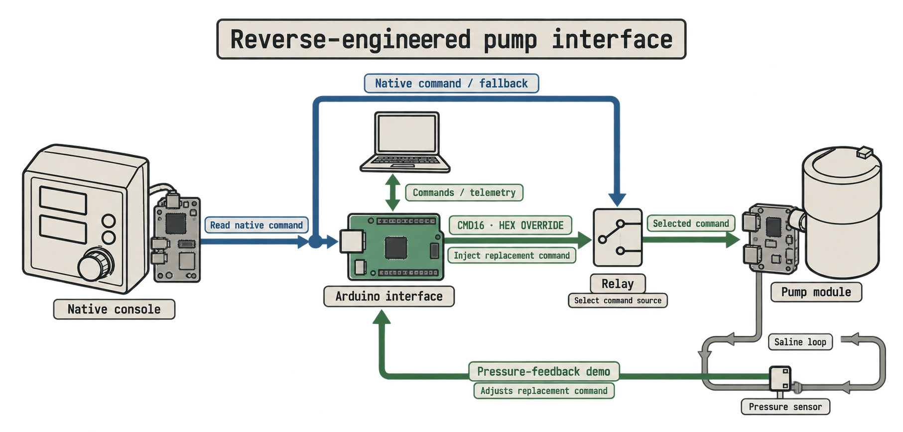

# SCP/SCPC — Arduino Pump Interface

**Adding programmable control to a retired perfusion pump.**

This project uses a Sorin/Stöckert SCP/SCPC centrifugal pump with a removable Arduino interface. I reverse-engineered the commands sent between its control panel and motor drive, then used that connection to read, replay, and modify those commands.

The pressure-control demo shows one use for that: the Arduino adjusts the pump in response to changes in circuit pressure.

**Proof of concept · Tested on a saline bench loop · Research use only**

[Watch the demos](#demonstrations) · [Project resources](#project-resources) · [More background](WHAT_AM_I_LOOKING_AT.md)

## Demonstrations

| Watch | What you're looking at |
| --- | --- |
| **[Pressure control](PressureDemo_Revised.mp4)** | I change the resistance in the circuit, and the Arduino adjusts the pump command to bring the pressure signal back toward its starting value. |
| **[Return to native control](RelayDemo_Revised.mp4)** | The relay switches control back to the original pump panel. The pump keeps running; this returns control to the panel, not a pump-stop command. |

[More about the setup and demos →](docs/DEMONSTRATIONS.md)

## Why I built this

I’m interested in automation for ex vivo perfusion research, particularly organ preservation. A lot of that work involves watching measurements and making adjustments at the pump. I wanted to see how much of that I could automate using hardware that was already available.

Retired clinical equipment can still have useful life left in it as research equipment. This pump already had the motor drive and pumping hardware. What I needed was a way to tell it what to do.

The SCP/SCPC is an older, relatively uncommon system. My goal was to show that this approach works well enough to justify trying it on newer, more common hardware. Each system would need its own interface work and testing.

## How it works

The interface plugs in at **ZPR 9909 A / CON2** and intercepts only **DATA**. The original CLOCK, FRAME, TACH, motor drive, and pump electronics stay in place.

| Existing system | What I added | What it does |
| --- | --- | --- |
| Native commands and timing | Arduino decoding and replay | Reads the pump command and sends a replacement with a bounded adjustment |
| Original control panel | Relay and direct DATA bypass | Returns control to the panel when the relay is deenergized |
| Saline bench loop | Pressure sensor and feedback code | Adjusts the command around an operator-selected starting point |

I decoded enough of the communication to make this interface work. Complete protocol emulation wasn’t part of the project.

[More about the interface and reverse engineering →](docs/INTERFACE.md)

## Project resources

| Resource | What's in it |
| --- | --- |
| **[Build & firmware](docs/BUILD_AND_FIRMWARE.md)** | Start here if you want to reproduce the interface: illustrated guide, code, and operating instructions |
| **[Hardware & software](Hardware_and_Software.md)** | Parts and tools I used, including details I couldn't recover from the development records |
| **[Pressure instrumentation](docs/PRESSURE_INSTRUMENTATION.md)** | The sensor used for the demo, how the code reads it, and what would need attention for an experiment |
| **[Signal captures](docs/SIGNAL_CAPTURES.md)** | Example logic-analyzer recordings from the reverse-engineering work |
| **[Development costs](docs/DEVELOPMENT_COSTS.md)** | What I spent during development, including tools, supplies, and exploratory purchases |
| **[Safety & research scope](docs/SAFETY.md)** | How fallback works, what was tested, and the full disclaimer |

## Research use and licensing

I tested this with saline on the bench. It has not been validated for animal, cadaveric, or isolated-organ work. The pressure demo uses a sensor signal as its target, not a calibrated pressure setting.

**Use only permanently decommissioned equipment. Not for clinical or patient-care use. Do not return modified or interfaced equipment to clinical service.**

Matthew Stubler · [Code: PolyForm Noncommercial](LICENSE-CODE.md) · [Documentation: CC BY-NC 4.0](LICENSE-DOCS.md)

Commercial use requires separate permission.
