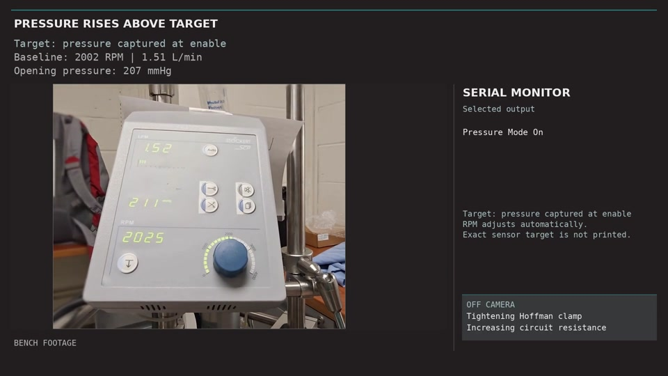
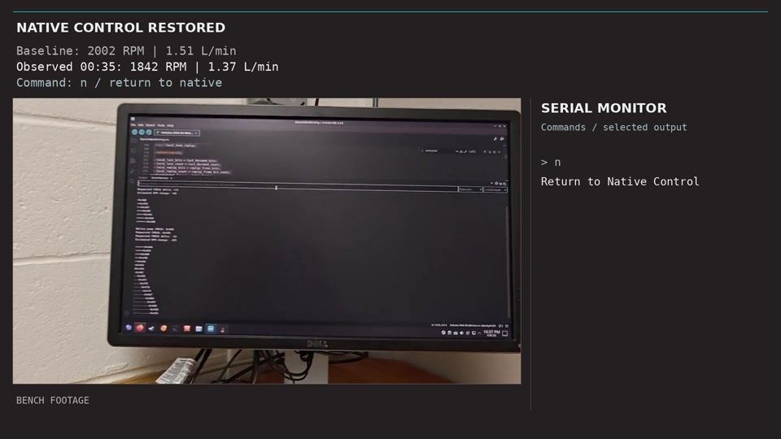

# Demonstrations

[Project home](../README.md) · [Build & firmware](BUILD_AND_FIRMWARE.md) · [Interface](INTERFACE.md)

The two demonstrations show the recovered command interface in use on a surrogate-fluid benchtop circuit. The pressure-feedback loop runs on the Arduino; the computer provides programming and serial interaction.

## Pressure-feedback control

**[Watch the pressure-control demonstration · 1 min](../media/demos/PressureDemo_1080p30_SquareView.mp4)**

The operator first establishes a bench operating condition under native control. Starting pressure mode captures the current filtered pressure-sensor reading and accepted native command. The Arduino then adjusts the replacement command around that baseline in response to changes in the pressure signal.

An adjustable downstream restriction changes the circuit's hydraulic resistance. The demonstration shows automatic command correction in response to that disturbance.

The target and feedback are **ADC counts, not calibrated pressure units**. This demonstrates feedback through the recovered command interface; it does not establish calibrated pressure accuracy, flow regulation, or performance in an organ-perfusion experiment.

[Pressure instrumentation and control units →](PRESSURE_INSTRUMENTATION.md)

## Direct RPM control

**[Watch the direct RPM control demonstration · 56 sec](../media/demos/RelayDemo_1080p30_Boxed.mp4)**

The Arduino changes pump speed by replacing the internal control command with a bounded offset from the captured baseline. Releasing external control deenergizes the interface relay and restores a direct native DATA path from the original pump panel to the motor-control board. The panel resumes command authority.

**Returning to native control does not stop the pump.** This demonstrates command-path fallback; it does not establish a general fault-detection or pump-shutdown system.

[Relay architecture and research-use limitations →](SAFETY.md)

## Bench setup

  

The documented setup used a centrifugal pump head, perfusion tubing, saline-bag reservoir, adjustable downstream restriction, and an added analog pressure sensor alongside existing pressure monitoring. Displayed RPM and indicated flow were observed; the published Arduino sketch does not measure flow or RPM.

See the [hardware reference](Hardware_and_Software.md) for the documented components and unknown model numbers, or [build & firmware](BUILD_AND_FIRMWARE.md) for the illustrated assembly and operating guide.
