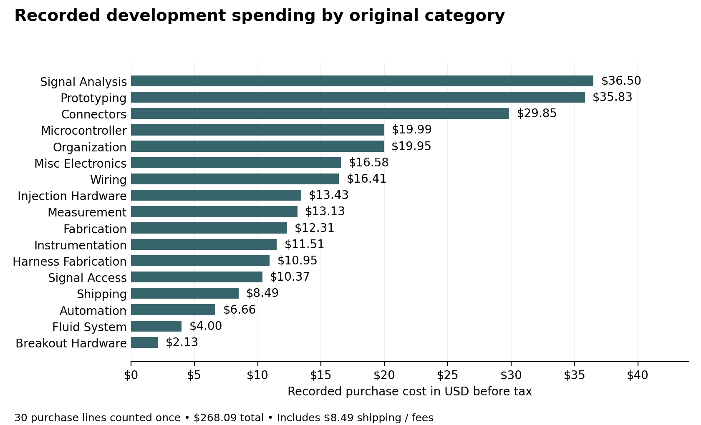

# Development costs

[Project home](../README.md) · [Build & firmware](BUILD_AND_FIRMWARE.md) · [Interface](INTERFACE.md)

Historical recorded spending for the SCP/SCPC interface project. **This is not a quote or the minimum cost of reproducing one interface.**

## Recorded spending

The 30 purchase lines total **\$268.09 before tax**, including **\$8.49 in shipping or fees**. The workbook reports **\$291.21 as “actual spent”** after rounding. The \$23.12 difference is not allocated to individual items in this document. These are historical recorded purchases, not current quotations or a complete cost to reproduce the system.

The chart preserves the expense workbook’s original categories, including historical classifications that do not describe the final circuit. Both workbook tabs repeat the same purchases; each line is counted once. Existing pump equipment, computers, development time, and unitemized supplies are outside this purchase total.

## What the total does and does not include

Purchases include reusable tools, multipacks, exploratory components, and general bench supplies. Existing pump equipment, computers, labor, and some pre-existing supplies are not included. Purchased quantities, spare inventory, and unitemized components are mixed, so a reliable minimum one-unit build cost cannot be derived from this ledger.

For the parts used in the final interface, start with the [hardware reference](../Hardware_and_Software.md) and [illustrated build guide](../SCP_SCPC_GitHub_Build_Guide.pdf). Exploratory purchases are not automatically required for reproduction.

## Itemized recorded purchases

Amounts are USD purchase-line totals before tax. Descriptions and categories below follow the source spreadsheet, including provisional or outdated purpose labels. The [hardware and software reference](../Hardware_and_Software.md) establishes actual use where later evidence is available. The companion [RECORDED_EXPENSES.csv](../RECORDED_EXPENSES.csv) retains dates, original project-specific flags, purposes, and notes for all 30 lines.

| Recorded item | Vendor | Original category | USD |
| :---- | :---- | :---- | ----: |
| MKS CANable Pro (Isolated) | AliExpress | Signal Analysis | 23.81 |
| MHCN United Co. Ltd Order | AliExpress | Misc Electronics | 16.58 |
| HiLetgo 24MHz 8CH Logic Analyzer | Amazon | Signal Analysis | 12.69 |
| IC Test Clip Set | AliExpress | Signal Access | 10.37 |
| P1308B Probe/Test Lead Kit | AliExpress | Measurement | 13.13 |
| Soldering Clamp Set | AliExpress | Fabrication | 2.32 |
| SN-58B Ratcheting Crimper | AliExpress | Harness Fabrication | 10.95 |
| MB-102 Breadboard Kit | AliExpress | Prototyping | 4.88 |
| 620pc Dupont Header Kit | AliExpress | Connectors | 6.21 |
| Dupont Jumper Kit 20cm | AliExpress | Connectors | 6.02 |
| Nano Expansion Shield | AliExpress | Breakout Hardware | 2.13 |
| Dupont Jumper Kit 10cm | AliExpress | Connectors | 5.53 |
| Arduino Uno R4 Minima | Micro Center | Microcontroller | 19.99 |
| Adafruit Parts Pal | Micro Center | Organization | 19.95 |
| SN74HC125N Quad Bus Buffer | Mouser | Injection Hardware | 6.30 |
| DFRobot Gravity Relay Module | Mouser | Automation | 6.66 |
| 14-pin IC Sockets | Mouser | Prototyping | 5.94 |
| SparkFun TXS0108E Level Shifter | Mouser | Injection Hardware | 7.13 |
| KF301 Screw Terminal Blocks | Mouser | Connectors | 4.18 |
| Shipping / Fees | Mouser | Shipping | 8.49 |
| FR4 Prototype PCB Boards | AliExpress | Prototyping | 4.02 |
| 22 AWG Silicone Wire | AliExpress | Wiring | 2.62 |
| Brass NPT Hose Barb Fitting | AliExpress | Fluid System | 4.00 |
| KF301 Screw Terminal Kit | AliExpress | Connectors | 7.91 |
| 5V 30 PSI Pressure Transducer | AliExpress | Instrumentation | 11.51 |
| Heat Shrink Kit | AliExpress | Wiring | 3.80 |
| IPSG Jumper Wire Bundle 3pcs | Micro Center | Wiring | 9.99 |
| iFixit Solder Tip Cleaner | Micro Center | Fabrication | 9.99 |
| SchmartBoard 0.1in Spacing 80 Dual Row | Micro Center | Prototyping | 8.49 |
| Adafruit Perma-Proto 3 Pack | Micro Center | Prototyping | 12.50 |
| **Total before tax** |  |  | **268.09** |

The workbook reports “actual spent” as 291.2127625, displayed here as **\$291.21**. That value equals the subtotal multiplied by 1.08625, consistent with an 8.625% tax adjustment. This arithmetic does not independently verify receipts or tax treatment for each transaction. No tax has been allocated across the chart categories.
