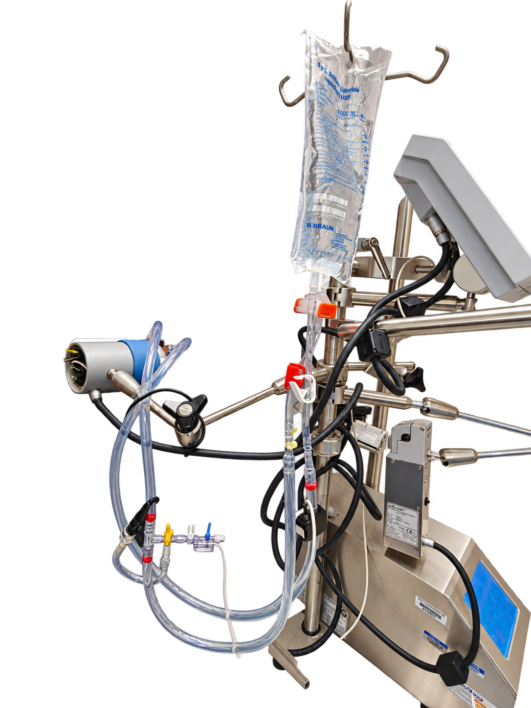

# Orientation page

## This is an SCP.

It’s an early-2000s-era Sorin/Stöckert centrifugal blood pump. This one is retired from clinical service, and I attached an Arduino to it.

  

## What did you do for this project?

I built a removable Arduino man-in-the-middle interface between the control panel and motor drive. It intercepts and modifies the pump commands so software can control pump speed. A relay restores the original control path when external control is released.

## You jailbroke an old heart-lung machine? Why would someone want to do that?

Sort of. This is upcycling for research.

Research equipment is expensive. Retired clinical pumps can be cheap and available, but they weren’t designed for custom research automation. Making them programmable lets us reuse capable blood-handling hardware for experiments that would otherwise require manual adjustments or a purpose-built system.

My interest is organ-perfusion research, where the pump could adjust itself in response to sensor measurements.

## Is this finished?

No. I identified an exploit that allowed semi-autonomous control and reverse-engineered only what I needed to use it. This doesn’t replace the console or fully emulate its protocol.

It’s a DIY proof of concept using one old pump. The goal was to demonstrate that this is a practical approach for decommissioned hardware.

## I’d like to get involved.

Excellent—that was the point! This wasn’t supposed to end with one old pump.

If you’re interested in reverse engineering perfusion equipment or building on this work, [contact me through LinkedIn](https://www.linkedin.com/in/mstubler). Let’s talk. (No email listed here to prevent spam.)

## What am I seeing in the demos?

- **Direct RPM control:** The Arduino changes pump speed by spoofing the internal control command. Releasing control reconnects the original panel.
- **Pressure control:** I change the circuit resistance, and the Arduino adjusts pump speed to bring the pressure signal back toward its starting value.

Both use a saline loop. The pressure demo follows a sensor baseline rather than a calibrated pressure target.

[Watch the demos →](DEMONSTRATIONS.md)

## How did you do it?

The reverse-engineering walkthrough is in a methods paper currently under review, so I’m saving that explanation for publication. I’ll link it here when it’s out.

## Okay I'm ready for the technical details.

- [Interface overview](INTERFACE.md): how command interception and relay fallback work.
- [Build & firmware](BUILD_AND_FIRMWARE.md): the illustrated guide, Arduino code, and operating instructions.
- [Safety & limitations](SAFETY.md): what was tested and what wasn’t.

**This was tested only on a saline bench loop. Use only permanently decommissioned equipment. Not for patient care.**

[← Project home](../README.md)